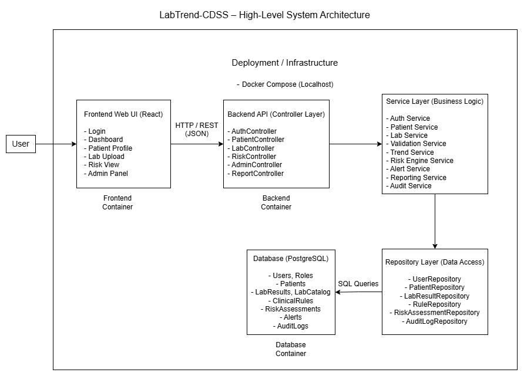
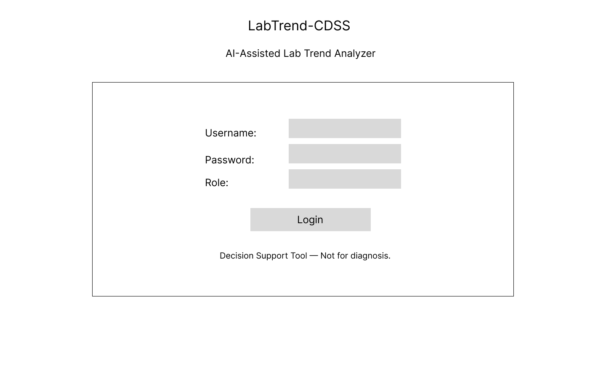
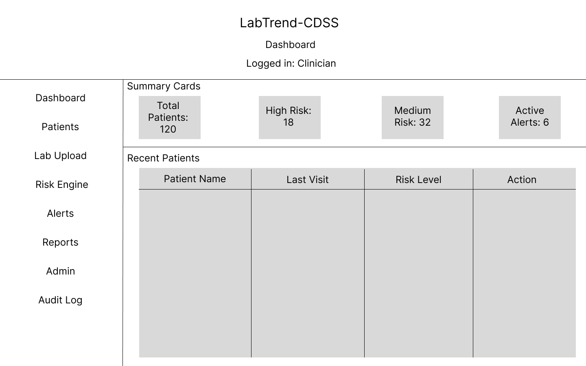
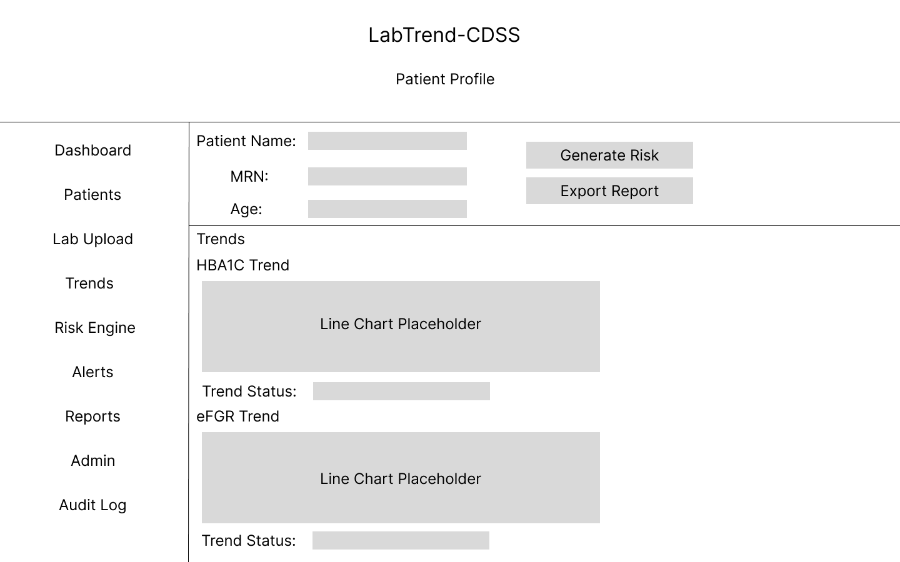
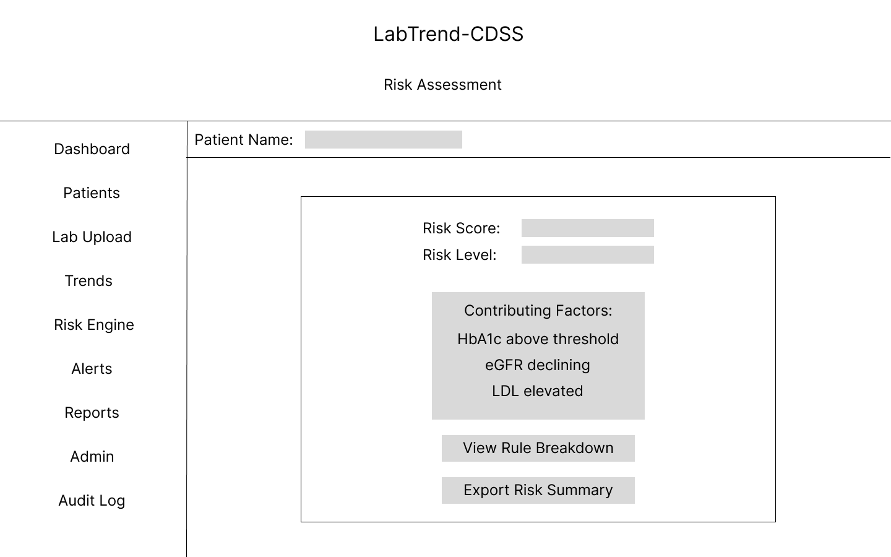
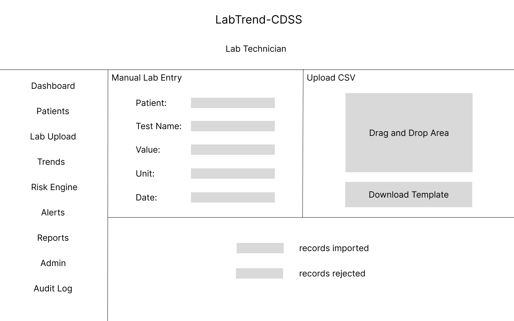
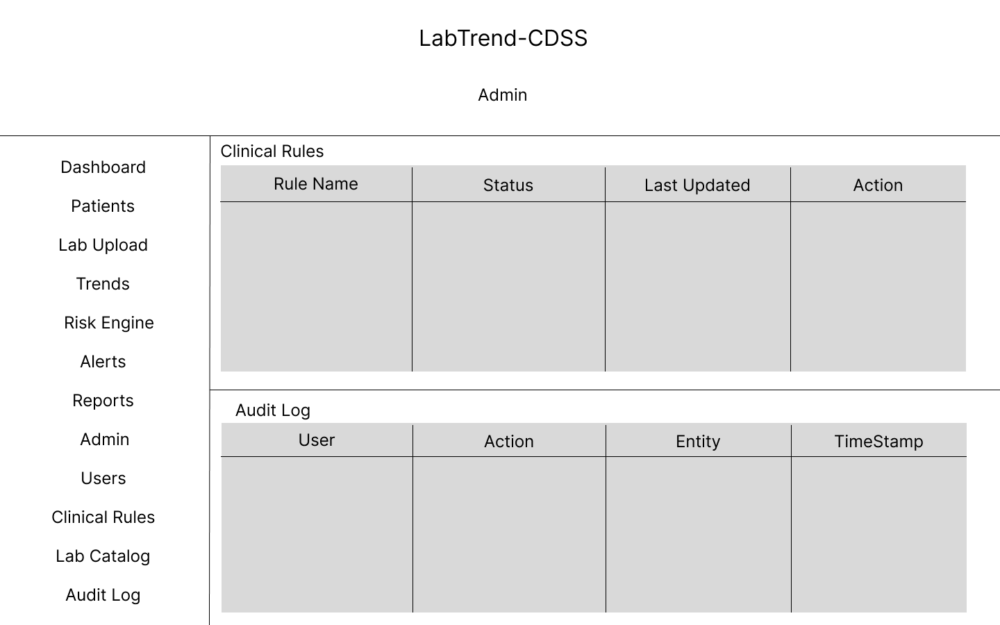

# LabTrend-CDSS
AI-Assisted Lab Trend Analyzer & Clinical Decision Support System

## Project Overview
LabTrend-CDSS is a web-based Clinical Decision Support System (CDSS) designed to help clinicians interpret longitudinal laboratory data, identify abnormal trends, and generate early disease risk stratification using transparent, rule-based logic. The system focuses on trend analysis, explainability, and decision support rather than diagnosis or treatment recommendation.

## Problem It Solves
In many healthcare environments, laboratory reports are reviewed as isolated values rather than as time-based trends. This can result in missed early warning signs, delayed intervention, and inconsistent follow-ups. Existing enterprise systems are often expensive, complex, and unsuitable for academic or small-scale deployments. LabTrend-CDSS addresses this gap by providing a lightweight, explainable, and role-based platform for lab trend interpretation and early risk screening.

## Target Users (Personas)

### Clinician
- Reviews patient lab trends and risk indicators
- Needs explainable, non-diagnostic decision support
- Uses the system for screening and prioritization

### Lab Technician
- Enters and uploads lab results
- Corrects data entry errors
- Ensures data quality and consistency

### System Admin
- Manages users and roles
- Configures lab tests, units, and thresholds
- Maintains audit and governance controls

## Vision Statement
To provide a professional yet accessible clinical decision support platform that transforms raw laboratory data into meaningful, explainable insights for early disease risk identification.

## Key Features / Goals
- Secure role-based login
- Patient profile management
- Manual and CSV-based lab data entry
- Lab input validation
- Time-series lab trend visualization
- Rule-based early disease risk stratification
- Explainable risk outputs
- Alerts for abnormal labs and high-risk cases
- Audit logging and traceability
- Exportable patient summary reports

## System Architecture

LabTrend-CDSS follows a layered client-server architecture using Controller, Service, and Repository layers. This separation ensures modularity, abstraction, low coupling, and maintainability. The system is containerized using Docker for consistent local development and optional cloud deployment.

### Updated High-Level Architecture (DA2)

The architecture consists of:

- Frontend (React Web UI)
- Backend API (Controller Layer)
- Service Layer (Business Logic Modules)
- Repository Layer (Data Access)
- PostgreSQL Database
- Docker-based deployment environment

## User Interface Design (DA2)

The UI follows a role-based, modular layout with consistent navigation and structured content areas. Each screen has a single responsibility, ensuring high cohesion, clarity, and ease of use.

### Updated Wireframes

Wireframes are available in `docs/design/ui/`.

Flow order:
1. Login  
2. Dashboard  
3. Patient Profile  
4. Risk Assessment  
5. Lab Technician  
6. Admin  

### Figma Prototype

The prototype demonstrates screen flow and interaction logic across roles.
[https://your-updated-figma-link](https://www.figma.com/design/LF01LhhPHoeaoD8a2p4oR6/LabTrend-CDSS?node-id=0-1&t=RKLgKlm8iq5X1FJS-1)

## Branching Strategy

This project follows **GitHub Flow**.  
- The `main` branch contains stable code.
- Feature development is done in separate branches.
- Changes are merged back into `main` via pull requests.

Example feature branches:
- `feature/docker-setup`

## Local Development Setup

### Tools Used
- GitHub
- Docker Desktop
- Docker Compose
- Python 3.10
- Node.js 18
- Figma (Wireframes)
- Draw.io (Architecture & Design Diagrams)

### Quick Start – Local Development

docker compose build
docker compose up

## Success Metrics
- End-to-end workflow completion without errors
- Accurate lab trend visualization
- Risk outputs consistent with configured rules
- At least 80% usability success in test users
- Successful demo using synthetic datasets

## Assumptions
- Data used is synthetic or non-sensitive
- Users have access to a modern web browser
- Lab units and reference ranges are standardized
- System is used for decision support only

## Constraints
- Academic timeline (8–12 weeks)
- Open-source technologies only
- No diagnostic or treatment claims
- Student-level development resources

## Software Design Decisions

The following design principles were applied during system refinement:

- Layered architecture (Controller → Service → Repository) to separate concerns and reduce coupling.
- Dedicated Risk Engine service to isolate clinical rule evaluation logic.
- Repository pattern to abstract database operations.
- Role-Based Access Control (RBAC) for secure and controlled access.
- Docker containerization for consistent deployment and scalability.

These decisions improve modularity, maintainability, extensibility, and architectural clarity, ensuring the system can evolve without structural disruption.

## Design Documentation

Detailed design artifacts are available in:

`docs/design/`

This includes:
- Updated architecture diagrams
- UI wireframes
- Editable diagram source files
